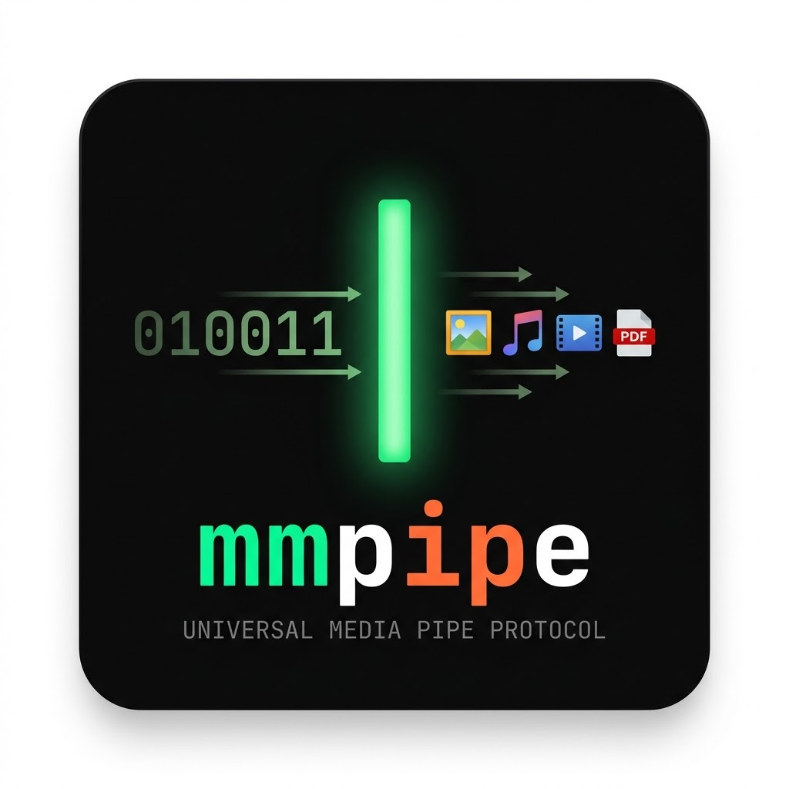

# MMPipe — Multimodal Unix Fix

[](https://github.com/bretkerr/MMPipe/actions/workflows/test.yml)



The Unix pipe (`|`) assumes everything is text. When you pipe binary media (an image, a video frame, an audio clip), the receiving program has no idea what it's looking at — no MIME type, no boundaries, just a stream of bytes that text-rendering tools immediately corrupt.

MMPipe fixes this with the **Universal Media Pipe Protocol (UMPP)**: a lightweight, dependency-free framing layer that wraps binary payloads with machine-readable metadata headers, routes them through a vision AI (Google Gemini), and hands plain UTF-8 text back to the pipe so legacy tools like `grep`, `awk`, and `sed` work exactly as Thompson intended.

---

## The Protocol

Every UMPP stream begins with a signature header block:

```
MMP/1.0
Content-Type: image/png
Content-Length: 84321

<raw binary payload>
```

The magic bytes `MMP/1.0\n` let any downstream program instantly distinguish a UMPP stream from raw binary or plain text. No guessing. No magic-byte sniffing required (though `analyze_vision` falls back to sniffing if you pipe with plain `cat`).

---

## Installation

```bash
git clone https://github.com/bretkerr/MMPipe.git
cd MMPipe
chmod +x mm.py
```

Add aliases to `~/.zshrc` or `~/.bashrc`:

```bash
export GEMINI_API_KEY="your_api_key_here"
alias mcat="/path/to/MMPipe/mm.py mcat"
alias analyze_vision="/path/to/MMPipe/mm.py analyze_vision"
```

```bash
source ~/.zshrc
```

No pip installs. No virtual environments. Python stdlib only.

---

## Usage

```bash
# Basic: describe an image
mcat photo.jpg | analyze_vision

# With a custom prompt
mcat diagram.png | analyze_vision "List every label visible in this diagram."

# Pipe the AI output to legacy Unix tools
mcat screenshot.png | analyze_vision "What colors appear in this image?" | grep -i red

# Works with plain cat too (magic-byte fallback)
cat photo.jpg | analyze_vision "What is this?"
```

Without a `GEMINI_API_KEY` set, `analyze_vision` runs in mock mode and prints a placeholder response — useful for testing the pipe plumbing without an API key.

---

## How It Works

| Step | Command | Role |
|------|---------|------|
| 01 | `mcat` | Emits UMPP-framed binary to stdout |
| 02 | `\|` | Standard Unix pipe — unchanged |
| 03 | `analyze_vision` | Reads UMPP frame, calls Gemini, prints text |
| 04 | `grep` / `awk` / `sed` | Consumes plain UTF-8 as normal |

The "Sacred Contract" of Unix pipes is restored: every boundary between programs is plain text. The multimodal complexity is fully contained inside `analyze_vision`.

---

## Supported Image Formats

UMPP carries any MIME type. `analyze_vision` currently accepts:

- `image/jpeg`
- `image/png`
- `image/gif`
- `image/webp`

---

## Requirements

- Python 3.10+ (walrus operator `:=` used in `emit`)
- `GEMINI_API_KEY` environment variable (optional — mock mode if absent)
- No third-party packages

---

## License

MIT
